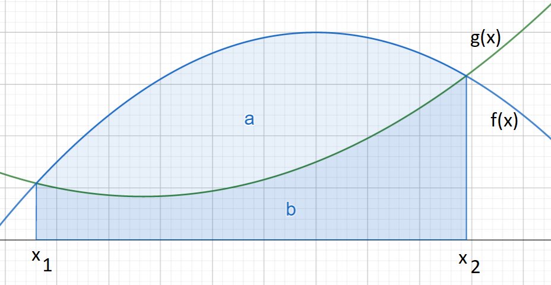
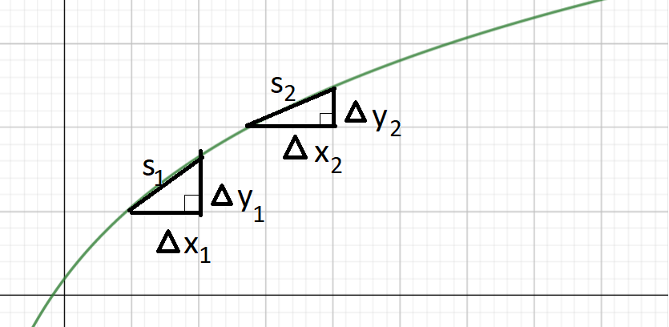

# Määrätyn integraalin sovelluksia

Määrätyn integraalin avulla voidaan laskea funktioiden kuvaajien rajoittamia pinta-aloja. Käytännössä lasku voisi tuottaa esimerkiksi tiettynä aikavälinä kuljetun matkan, kun etenemisnopeus vaihtelee. Tarkastellaan tässä muutamia hieman erilaisia määrätyn integraalin sovelluksia.

## Käyrien välisiä pinta-aloja

Tähän asti määrätyn integraalin avulla on laskettu pinta-aloja funktion $f(x)$ kuvaajan ja vaaka-akselin välillä, kun alue rajataan kahdella suoralla $x=x_1$ ja $x=x_2$. Pinta-aloja voidaan laskea myös kahden funktion, $f(x)$ ja $g(x)$, väliltä.

Tarkastellaan kuvan mukaista tilannetta. Merkitään funktioiden $f(x)$ ja $g(x)$ kuvaajien väliin jäävää pinta-alaa $A$. Oletetaan, että $f(x_1)=g(x_1)$ ja $f(x_2)=g(x_2)$, eli funktioiden kuvaajan leikkaavat pisteissä $x_1$ ja $x_2$. Tällöin pinta-ala saadaan laskemalla:

$A=\int_{x_1}^{x_2} f(x)~\text{d}x - \int_{x_1}^{x_2} g(x)~\text{d}x$

Perusteluna laskukaavalle on:
- $\int_{x_1}^{x_2} f(x)~\text{d}x$ määrittää funktion $f(x)$ ja $x$-akselin väliin jäävän pinta-alan $a$
- $\int_{x_1}^{x_2} g(x)~\text{d}x$ määrittää funktion $g(x)$ ja $x$-akselin väliin jäävän pinta-alan $b$
- edellisten alueiden erotus on funktioiden $f(x)$ ja $g(x)$ väliin jäävä pinta-ala $A=a-b$

Käytännössä ensin joudutaan lasketaan, milloin $f(x)=g(x)$ eli miten valitaan määrätyn integraalin rajat $x_1$ ja $x_2$.

::::{admonition} Esimerkki

Laske funktioiden $3x^2$ ja $x+4$ kuvaajien väliin jäävä pinta-ala. Funktioiden kuvaajat on esitetty alla.

:::{admonition} Ratkaisu
:class: tip, dropdown

Koska leikkauspisteiden välissä pätee $x+4 \geq 3x^2$, niin valitaan $f(x)=x+4$ ja $g(x)=3x^2$. Lasketaan, milloin funktioiden arvot ovat yhtä suuret, eli missä pisteissä niiden kuvaajat leikkaavat:

$3x^2=x+4$

$3x^2-x-4=0$

$x=\frac{-(-1)\pm \sqrt{(-1)^2-4\cdot 3\cdot (-4)}}{2\cdot 3}$

$x=\frac{1\pm \sqrt{49}}{6}$

$x=\frac{1\pm 7}{6}$

Leikkauspisteiksi saadaan $x_1=\frac{1-7}{6}=-1$ ja $x_2=\frac{1+7}{6}=\frac{4}{3}$.

Nyt voidaan laskea ala:

$\begin{align}
& A=\int_{-1}^{4/3} x+4~\text{d}x - \int_{-1}^{4/3} 3x^2~\text{d}x \\
& = \overset{4/3}{\underset{-1}{/}} \frac{1}{2}x^2+4x - \overset{4/3}{\underset{-1}{/}} x^3 \\
& = \left[\left(\frac{1}{2}\cdot \left(\frac{4}{3}\right)^2+4\cdot\frac{4}{3}\right) - \left(\frac{1}{2}\cdot(-1)^2+4\cdot (-1)\right) \right]\\
& - \left[\left(\frac{4}{3}\right)^3-(-1)^3\right]\\
& = \left(\frac{16}{18}+\frac{16}{3}\right)-\left(\frac{1}{2}-4\right)-\left(\frac{64}{27}+1\right) \\
& = \frac{343}{54}
\end{align}$

:::

::::

## Kaaren pituus

Funktion $f(x)$ kuvaajan kaaren pituus $s$ välillä $x_1 \leq x \leq x_2$ saadaan kaavalla 

$s=\int_{x_1}^{x_2} \sqrt{1+[f'(x)]^2}~\text{d}x$

:::{admonition} Perustelu
:class: tip, dropdown

Perusteluna voidaan käyttää seuraavaa kuvaa:

Kaaren pituus $s$ jakautuu osapituuksiin $s_1,s_2, \dots s_n$. Jokaisen osan pituutta $s_i$ approksimoidaan suorakulmaisen kolmion hypotenuusalla, kun kolmion kateetit ovat $\Delta x_i$ ja $\Delta y_i$. Kateettien avulla ilmaistuna pituus on Pythagoraan lauseen mukaisesti $s_i=\sqrt{(\Delta x)^2+(\Delta y)^2}$. Neliöjuuren sisällä oleva lauseke voidaan kirjoittaa myös seuraavassa muodossa:

$(\Delta x_i)^2+(\Delta y_i)^2=(\Delta x_i)^2 \left(1+\frac{(\Delta y_i)^2}{(\Delta x_i)^2}\right)$

Karkea arvo koko kaaren pituudelle saadaan summana näistä pituuksista:

$s\approx \Sigma_{i=1}^n \sqrt{(\Delta x_i)^2 \left(1+\frac{(\Delta y_i)^2}{(\Delta y_i)^2}\right)}$

Varsinaisesti kaaren pituus saadaan raja-arvona, jossa kaari on jaettu äärettömään moneen osaan $s_i$:

$s=\lim_{n\to\infty} \Sigma_{i=1}^n \sqrt{(\Delta x_i)^2 \left(1+\frac{(\Delta y_i)^2}{(\Delta x_i)^2}\right)}$

Osamäärä $\frac{\Delta y_i}{\Delta x_i}$ on sama kuin $f'(x)$, jos $\Delta x$ lähenee nollaa. Näinhän käykin, kun osapituuksen $s_i$ määrä lähenee ääretöntä. Edelleen integraalin määritelmän perusteella summa, jossa yhteenlaskettavia on äärettömän monta, voidaan esittää integraalina:

$s=\int \sqrt{1+[f'(x)]^2}~\text{d}x$

:::

::::{admonition} Esimerkki

Laske funktiota $f(x)=\frac{2}{3} x\sqrt{x}$ kuvaavan kaaren pituus välillä $0 \leq x \leq 1$.

:::{admonition} Ratkaisu
:class: tip, dropdown

Kaaren pituuden laskukaavaan tarvitaan funktion $f(x)$ derivaatta $f'(x)$. Derivaatan laskua varten muutetaan funktio $f(x)$ murtopotenssimuotoon:

$f(x)= \frac{2}{3} x\cdot x^{1/2}= \frac{2}{3} x^{1+\frac{1}{2}}=\frac{2}{3} x^{\frac{3}{2}}$

Derivaataksi saadaan nyt 

$f'(x)=\frac{2}{3}\cdot \frac{3}{2}x^{\frac{1}{2}}=x^{\frac{1}{2}}$

Laskukaavaan tarvitaan derivaatan toinen potenssi:

$[f'(x)]^2=\left(x^{\frac{1}{2}}\right)^2=x$

Sijoitetaan tämä kaaren pituuden laskukaavaan:

$s=\int_0^1 \sqrt{1+x}~\text{d}x$

Integraaliksi saadaan

$\int \sqrt{1+x}~\text{d}x = \int (1+x)^{1/2}~\text{d}x = \frac{2}{3}(1+x)^{3/2}$

Kaaren pituus on siis

$s=\frac{2}{3} (1+1)^{3/2} - \frac{2}{3}(1+0)^{3/2} \approx 1.219$

:::
::::

## Funktion keskiarvo

Funktion $f(x)$ keskiarvo $\overline{f}(x)$ arvojen $x=a$ ja $x=b$ välissä saadaan laskemalla:

$\overline{f}(x)=\frac{1}{b-a} \int_a^b f(x)~\text{d}x$

:::{admonition} Perustelu
:class: tip, dropdown

Perustellaan kaava seuraavasti:
- jaetaan väli $[a,b]$ yhtä suuriin paloihin, joita on $n$ kappaletta
- jokaisen palan leveys on $\Delta x = \frac{b-a}{n}$
- palojen määrä $n$ voidaan ilmasta välin päätepisteiden ja osien leveyden avulla $n=\frac{b-a}{\Delta x}$
- lasketaan funktiot arvot jokaisessa välin $[a,b]$ jakopisteessä $x_1, x_2, \dots ,x_n$, arvot ovat siis $f(x_1), f(x_2), \dots, f(x_n)$
- funktion keskiarvo on tällöin

$\overline{f}(x)=\frac{f(x_1)+f(x_2)+\dots+f(x_n)}{n} $

Sijoittamalla $n=\frac{b-a}{\Delta x}$ saadaan

$\overline{f}(x)= \frac{f(x_1)+f(x_2)+\dots+f(x_n)}{\frac{b-a}{\Delta x}}$,

joka sievenee muotoon

$\overline{f}(x)= \frac{\Delta x}{b-a} \left(f(x_1)+f(x_2)+\dots+f(x_n)\right) = \frac{\Delta x}{b-a} \Sigma_{i=1}^n f(x_i)$,

missä $\Sigma_{i=1}^n f(x_i)$ on lyhennysmerkintä summalle $f(x_1)+f(x_2)+\dots+f(x_n)$.

Mitä enemmän on osavälejä, sitä tarkemmin funktion keskiarvo saadaan laskettua. Ääritapauksena lasketaan raja-arvo, jossa $n \to \infty$:

$\overline{f}(x)=\lim_{n \to \infty} \frac{1}{b-a} \Delta x \Sigma_{i=1}^n f(x_i)$

eli toisin kirjoitettuna

$\overline{f}(x)= \frac{1}{b-a} \lim_{n \to \infty} \Sigma_{i=1}^n f(x_i) \Delta x$,

jossa loppuosa on sama kuin määrätyn integraalin määritelmä:

$\overline{f}(x)= \frac{1}{b-a} \int_a^b f(x)~\text{d}x$.

:::

::::{admonition} Esimerkki

Laske funktion $f(x)=3x^2+2x$ keskiarvo välillä $1\leq x \leq 3$.

:::{admonition} Ratkaisu
:class: tip, dropdown

Funktion $f(x)=3x^2+2x$ integraalifunktio, jossa $C=0$, on $F(x)=x^3+x^2$.

Niinpä funktion keskiarvo annetulla välillä on 

$\begin{align}
\overline{f}(x) & = \frac{1}{3-1} \int_1^3 3x^2+2x~\text{d}x \\
& = \frac{1}{2} \left((3^3+3^2)-(1^3+1^2)\right) \\
& = \frac{1}{2} (27+9-1-1) = 17\end{align}$

:::

::::