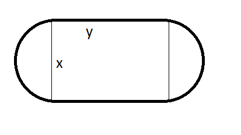

# Monen muuttujan funktion optimointi

Ääriarvojen avulla voidaan etsiä funktioiden maksimi- tai minimiarvoja. Käytännössä tällaisia laskuja tarvitaan, kun halutaan optimoida jotakin. Tilanteesta riippuu, onko optimaalinen arvo mahdollisimman suuri vai mahdollisimman pieni. Esimerkiksi laitteiden tai raaka-aineiden kuljetukseen tarvittavan matkan olisi hyvä olla mahdollisimman pieni, kun taas tuotannolla ansaittavan rahamäärän tulisi mielellään olla mahdollisimman suuri.

Yhden muuttujan funktioiden minimi- tai maksimiarvo löytyy derivaatan nollakohdista tai tarkasteltavan välin päätepisteistä. Useamman muuttujan tapauksessa on tarkasteltava osittaisderivaattojen nollakohtia.

## Kaksi muuttujaa

Merkitään kahden muuttujan funktiota $f(x,y)$. Tällaista funktiota ei voida piirtää käyränä koordinaatistoon, vaan funktion graafinen esitys vastaisi kolmiulotteista pintaa. Tällaista pintaa voisi (ainakin mielikuvina) vastata esimerkiksi rutussa oleva matto tai wokkipannun kaareva sisäpinta. Toki myös esimerkiksi maapalloa tai meren pohjaa erilaisine pinnanmuotoineen voitaisiin kuvata (ja kuvataankin) kahden muuttujan funktiona. Tällöin muuttujina olisivat paikkaa tasossa kuvaavat koordinaatit, esimerkiksi pituus- ja leveysasteet.

Maksimi- tai minimiarvot olisivat tällaisten pintojen matalimpia tai korkeimpia kohtia. Erona yhden muuttujan funktioon on se, että nämä minimit ja maksimit löytyvät sellaisista pisteistä $(x,y)$, joissa derivaatta on kummankin muuttujan suhteen nolla. Käytännössä laskutehtävästä voi tulla hyvin pitkä ja hankalakin, ja siinä kannattaa hyödyntää tietokonetta.

::::{admonition} Esimerkki

Pihalla on kohteet A, B ja C, joiden sijainnit pihan koordinaatistossa ilmaistuna ovat $A=(0,0)$, $B=(0,3)$ ja $C=(10,0)$. Mistä pisteestä $(x,y)$ yhteenlaskettu matka näihin pisteisiin on mahdollisimman lyhyt?

:::{admonition} Ratkaisu
:class: tip, dropdown

Pisteen $(x,y)$ etäisyys pisteestä A on $\sqrt{x^2+y^2}$, pisteestä B $\sqrt{x^2+(y-3)^2}$ ja pisteestä C $\sqrt{(x-10)^2+y^2}$. Yhteenlaskettu matka on siis $f(x,y)=\sqrt{x^2+y^2}+\sqrt{x^2+(y-3)^2}+\sqrt{(x-10)^2+y^2}$.

Derivointi saattaa onnistua helpommin, kun neliöjuuret kirjoitetaan murtopotensseina:

$f(x,y)=(x^2+y^2)^{\frac{1}{2}}+(x^2+(y-3)^2)^{\frac{1}{2}}+((x-10)^2+y)^{\frac{1}{2}}$

Osittaisderivaatoiksi saadaan (käsin tai esim. WolframAlphalla):

$\frac{\partial f}{\partial x} = x(x^2+y^2)^{-\frac{1}{2}}+ x(x^2+(y-3)^2)^{-\frac{1}{2}}+x((x-10)^2+y^2)^{-\frac{1}{2}}$

$\frac{\partial f}{\partial y} = y(x^2+y^2)^{-\frac{1}{2}}+ y(x^2+(y-3)^2)^{-\frac{1}{2}}+y((x-10)^2+y^2)^{-\frac{1}{2}}$

Lopuksi pitäisi vielä ratkaista yhtälöpari:

$\begin{equation}\begin{cases} \frac{\partial f}{\partial x} = 0 \\\frac{\partial f}{\partial y} = 0\end{cases}\end{equation}$

[WolframAlpha](https://www.wolframalpha.com/) ratkaisee tehtävän suoraan komennolla:

solve d/dy sqrt(x^2+y^2)+sqrt(x^2+(y-3)^2)+sqrt((x-10)^2+y^2)=0, d/dx sqrt(x^2+y^2)+sqrt(x^2+(y-3)^2)+sqrt((x-10)^2+y^2)=0

Toinen vaihtoehto on käyttää komentoa Minimize:

minimize sqrt(x^2+y^2)+sqrt(x^2+(y-3)^2)+sqrt((x-10)^2+y^2)

Kummallakin tavalla ratkaisuiksi saadaan $x=0.82, y=1.09$.

:::

::::

Joskus funktion muuttujia sitoo jokin ehto. Tällöin funktio saadaan muokattua yhden muuttujan funktioksi, ja ääriarvo löytyy funktion derivaatan nollakohdan avulla. Muuttujia sitova ehto voi olla aluetta rajaavan aidan pituus, kolmiulotteisen kappaleen valmistukseen käytössä oleva materiaalin määrä, kappaleen tilavuus tms.

::::{admonition} Esimerkki

Pahvista taitellaan neliöpohjainen laatikko. Laatikon pohjaneliön sivu on $x$ ja laatikon korkeus on $y$. Laatikon tilavuuden tulisi olla 2 litraa eli 2000 kuutiosenttimetriä. Minkä muotoinen laatikon tulisi olla, että pahvia kuluisi mahdollisimman vähän? Oletetaan, että pahvia riittää joka kohtaan yksi kerros (saumakohtiin ei tule päällekkäistä pahvia, vaan reilusti teippiä).

:::{admonition} Ratkaisu
:class: tip, dropdown

Laatikkoon kuluvan pahvin määrä koostuu pohjasta, kannesta ja neljästä sivuseinämästä: siis pahvin pinta-ala on $A(x,y)=2x^2+4xy$.

Muuttujia sitovana ehtona toimii laatikon tilavuus $V=x^2 y$. Tästä ehdosta voidaan ratkaista $y=\frac{V}{x^2}$ (yhtä hyvin voitaisiin ratkaista myös $x$, mutta potenssiinkorotus tekee laskusta hieman hankalamman). Kun tämä sijoitetaan pinta-alan lausekkeeseen, saadaan

$A(x)=2x^2+4x\cdot \frac{V}{x^2}$ eli $A(x)=2x^2+\frac{4V}{x}$.

Derivoidaan funktio:

$A'(x)=4x-\frac{4V}{x^2}$

Etsitään derivaatan nollakohta:

$4x-\frac{4V}{x^2} = 0 \leftrightarrow x=\sqrt[3]{V} \leftrightarrow x=\sqrt[3]{2000~\text{cm}^3} \approx 12.6~\text{cm}$.

Pohjan sivuksi saatiin siis 12.6 cm, ja korkeudeksi voidaan laskea $y=\frac{2000~\text{cm}^3}{(12.6~\text{cm})^2} = 12.6~\text{cm}$.

:::

::::

## Lagrangen menetelmä

Yleisessä tapauksessa, jossa muuttujia voi olla enemmänkin kuin kaksi, eräs tapa optimointiin on Lagrangen menetelmä. Menetelmässä tarvitaan jokin muuttujia sitova ehto. Tarkastellaan esimerkkinä kahden muuttujan funktiota $f(x,y)$. Merkitään muuttujia $x$ ja $y$ sitovaa ehtoa funktiolla $g(x,y)=C, C\in \Re$. Näistä funktioista muodostetaan niinsanottu Lagrangen funktio $L(x,y,\lambda)$:

$L(x,y,\lambda)=f(x,y)-\lambda(g(x,y)-C)$

Funktion ääriarvot löytyvät kohdista, jossa kaikki Lagrangen funktion osittaisderivaatat ovat nollia, siis

$\frac{\partial L}{\partial x}=0, \frac{\partial L}{\partial y}=0, \frac{\partial L}{\partial \lambda}=0$.

Käytännössä ratkaistavaksi tulee siis yhtälöryhmä.

::::{admonition} Esimerkki

Urheilukenttä muodostuu suorakulmiosta ja päädyissä olevista puoliympyröistä. Suorakulmion pituus on $y$ ja leveys $x$, jolloin päädyssä olevien puoliympyröiden halkaisija on myös $x$. 

a) Millä mitoilla $x$ ja $y$ kentän keskellä jäävän suorakulmion pinta-ala on mahdollisimman suuri, kun kenttää rajaavan juoksuradan pituudeksi halutaan 800 metriä?

b) Millä mitoilla $x$ ja $y$ koko kentän sisälle jäävästä pinta-alasta saadaan mahdollisimman suuri, kun kenttää rajaavan juoksuradan pituus on edelleen 800 metriä?

:::{admonition} Ratkaisu
:class: tip, dropdown

Kentän ympärysmitta koostuu kahdesta pitkästä sivusta ja kahdesta puolikkaasta ympyrän kehästä. Pitkien sivun summa on $2y$. Kahdesta puoliympyrän kehästä muodostuu yksi kokonainen ympyrän kehä. Kehän pituus on on $2\pi \frac{x}{2}=\pi x$. Muuttujia sitova yhtälö on siis juoksuradan pituutta kuvaava funktio $g(x,y)=2y+\pi x$, ja koska radan pituus on määrätty, niin $2y+\pi x = 800$.

Muodostetaan maksimoitavaa pinta-alaa kuvaava funktio erikseen kohdissa a) ja b).

a) Keskelle jäävä alue on pinta-alaltaan $xy$. Muodostetaan Lagrangen funktio:

$L(x,y,\lambda)=xy-\lambda(2y+\pi x-800)$

$L(x,y,\lambda)=xy-2\lambda y-\pi \lambda x + 800\lambda$

Osittaisderivaatat ovat:

$\frac{\partial L}{\partial x}=y-\pi \lambda$,

$\frac{\partial L}{\partial y}=x-2\lambda$,

$\frac{\partial L}{\partial \lambda} = -2y -\pi x +800$

Yhtälöryhmälle 

$\begin{equation}\begin{cases}y-\pi \lambda=0\\x-2\lambda=0\\-2y -\pi x + 800=0\end{cases}\end{equation}$

saadaan ratkaisu $x = \frac{400}{\pi}, y = 200$.

b) Urheilukentän pinta-ala on suorakulmion alan $xy$ sekä kahden puoliympyrän alojen summa. Kaksi puolikasta ympyrää vastaa pinta-alaltaan yhtä kokonaista ympyrää. Kun ympyrän halkaisija on $x$, niin ympyrän ala on $\pi \frac{x^2}{4}$. Tällöin koko kentän pinta-alaksi saadaan $f(x,y)=xy+\pi \frac{x^2}{4}$.

Muodostetaan Lagrangen funktio:

$L(x,y,\lambda)=xy+\pi \frac{x^2}{4}-\lambda(2y+\pi x-800)$

$L(x,y,\lambda)=xy+\pi \frac{x^2}{4}-2\lambda y-\pi \lambda x + 800\lambda$

Osittaisderivaatat ovat:

$\frac{\partial L}{\partial x}=y+\frac{\pi}{2}x-\pi \lambda$,

$\frac{\partial L}{\partial y}=x-2\lambda$,

$\frac{\partial L}{\partial \lambda} = -2y -\pi x + 800$

Yhtälöryhmälle 

$\begin{equation}\begin{cases}y+\frac{\pi}{2}x-\pi \lambda=0\\x-2\lambda=0\\-2y -\pi x + 800=0\end{cases}\end{equation}$

saadaan ratkaisu $x = \frac{800}{\pi}, y = 0$. Toisin sanoen suurin kenttä olisi ympyrän muotoinen.

:::

::::