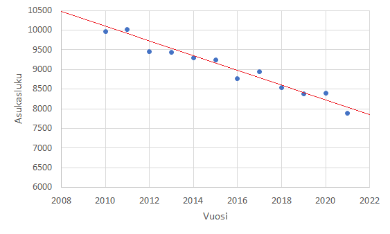

# Pienimmän neliösumman menetelmä

Pienimmän neliösumman menetelmän avulla voidaan muodostaa yksinkertainen funktio, joka kuvaa mahdollisimman hyvin jotakin pistejoukkoa. Pisteet voivat olla erilaisia mittaustuloksia. Esimerkiksi kunnan väkiluku voitaisiin laskea vuosittain, ja tällöin funktio $f(x)$ kuvaisi karkeasti kunnan asukaslukua vuonna $x$. Voisi olla hyödyllistä pystyä arvioimaan, mikä on väkiluku vaikkapa 10 vuoden kuluttua, jos kunnan kehitys jatkuu samantapaisena. Tällaisessa matemaattisessa mallinnuksessa ei pyritä muodostamaan monimutkaista funktiota, joka kuvaisi aineistoa tarkasti, vaan tavoitteena on riittävän tarkka, mahdollisimman yksinkertainen malli. Tarkastellaan tässä, miten pistejoukkoon voidaan sovittaa suora.

Oletetaan, että väkiluku on laskettu vuosina $x_0, x_1, \dots, x_n$ ja vastaavat asukasluvut ovat $y_0, y_1, \dots, y_n$. Väkiluvussa tapahtuu satunnaisia notkahduksia tai hyppäyksiä. Tavoitteena on löytää malli $y=ax+b$, joka kuvaa mahdollisimman hyvin koko dataa $(x_0,y_0 ),(x_1,y_1 ),\dots, (x_n,y_n)$, vaikka se ei osuisi kohdalleen minkään vuoden todellisen asukasluvun kanssa.

## Virheen minimointi

Pienimmän neliösumman menetelmässä yritään minimoimaan mittausdatan ja mallin antaman ennusteen välinen erotus. Yksittäisen pisteen $(x_i,y_i)$ poikkeama suoran antamasta ennusteesta on $y_i-(ax_i+b)$. Koska osa oikeista arvoista on suurempia kuin suoran yhtälön avulla lasketut arvot ja osa pienempiä, niin pisteiden eri suuntaiset poikkeamat suoralta voivat kumota toisensa. Tämä ei ole toivottavaa. Siksi menetelmässä lasketaan erotusten neliöiden summa ja pyritään minimoimaan se. Yksittäiselle pisteelle $(x_i,y_i)$ erotuksen neliö on $(y_i-(ax_i+b))^2 $. Kaikkien pisteiden ja mallin antaman ennusteen erotuksen neliöiden summaa merkitään lyhyemmin $E=\Sigma_{i=1}^n (y_i-ax_i-b)^2$.

Kokonaisvirheen $E=\Sigma_ {i=1}^n (y_i-ax_i-b)^2$ pienimmän arvon löytämiseksi on laskettava virheen osittaisderivaatat kerrointen $a$ ja $b$ suhteen. Koska summan derivaatta on derivaattojen summa, niin osittaisderivaatat saadaan seuraavasti:

$\frac{\partial E}{\partial a}=-2 \Sigma_{i=1}^n x_i (y_i-ax_i-b)^2$

$\frac{\partial E}{\partial b}=-2 \Sigma_{i=1}^n (y_i-ax_i-b)$

Asettamalla osittaisderivaatat nolliksi saadaan yhtälöt:

$nb+\Sigma_{i=1}^n x_i a=\Sigma_{i=1}^n y_i$,

$\Sigma_{i=1}^n x_i b + \Sigma{i=1}^n x_i^2 a=\Sigma_{i=1}^n x_i y_i$

::::{admonition} Esimerkki

Etsi suora, joka kuvaa parhaiten seuraavaa pistejoukkoa: $(1,2), (2,5), (3,3), (4,6)$.

:::{admonition} Ratkaisu
:class: tip, dropdown

Muodostetaan ratkaisu vaiheittain:

1) Lasketaan $\Sigma_{i=1}^4 x_i = x_1 + x_2 + x_3 +x_4 = 1+2+3+4=10$

2) Lasketaan $\Sigma_{i=1}^4 x_i ^2= x_1^2+x_2^2+x_3^2+x_4^2=1^2+2^2+3^2+4^2=30$

3) Lasketaan $\Sigma_{i=1}^4 y_i =y_1+y_2+y_3+y_4=2+5+3+6=16$

4) Lasketaan $\Sigma_{i=1}^4x_i y_i =x_1 y_1+x_2 y_2+ x_3 y_3 + x_4 y_4 = 1\cdot 2+2 \cdot 5 + 3 \cdot 3 + 4\cdot 6 = 45$

5) Muodostetaan yhtälöt:

$4\cdot b + 10 a = 16$, $10b+30a=45$

Yhtälöparista ratkeaa $a=1$ ja $b=\frac{3}{2}$. Pistejoukkoon sopii siis parhaiten suora $y=x+\frac{3}{2}$.

:::

::::

## Suoran sovitus matriisiyhtälönä

Voidaan todeta, että yhtälöparia

$\begin{equation}\begin{cases}nb+\Sigma_{i=1}^n x_i a=\Sigma_{i=1}^n y_i \\ \Sigma_{i=1}^n x_i b + \Sigma{i=1}^n x_i^2 a=\Sigma_{i=1}^n x_i y_i\end{cases}\end{equation}$

vastaa matriisiyhtälö $A^T AX=A^T Y$,

missä 

$Y=\begin{bmatrix} y_0 \\ y_1 \\ \vdots \\ y_n \end{bmatrix}, A=\begin{bmatrix} x_0 & 1\\ x_1 & 1 \\ \vdots \\ x_n & 1 \end{bmatrix}, X=\begin{bmatrix}a \\ b\end{bmatrix}$.

Parhaan suoran kertoimien $a$ ja $b$ löytämiseksi riittää siis ratkaista $X$ yhtälöstä $A^T AX=A^T Y$, siis $X=(A^T A)^{-1} A^T Y$.

::::{admonition} Esimerkki

Etsi paras sovitussuora edellisen esimerkin pistejoukolle ratkaisemalla matriisi $X=(A^T A)^{-1} A^T Y$.

:::{admonition} Ratkaisu
:class: tip, dropdown

Muodostetaan tarvittavat matriisit:

$Y=\begin{bmatrix}2 \\ 5 \\ 3 \\ 6\end{bmatrix}, A=\begin{bmatrix}1 & 1 \\ 2 & 1 \\ 3 & 1 \\ 4 & 1\end{bmatrix}$

Laskemalla matriisien laskutoimituksen (tietokoneella) saadaan ratkaisuksi $X=\begin{bmatrix}1\\1.5\end{bmatrix}$. Esimerkiksi [Octavella](https://octave-online.net/) laskutoimitus onnistuu komennoilla:

Y=[2;5;3;6], A=[1 1;2 1; 3 1; 4 1], X=inv(A'*A)*A'*Y

:::

::::

