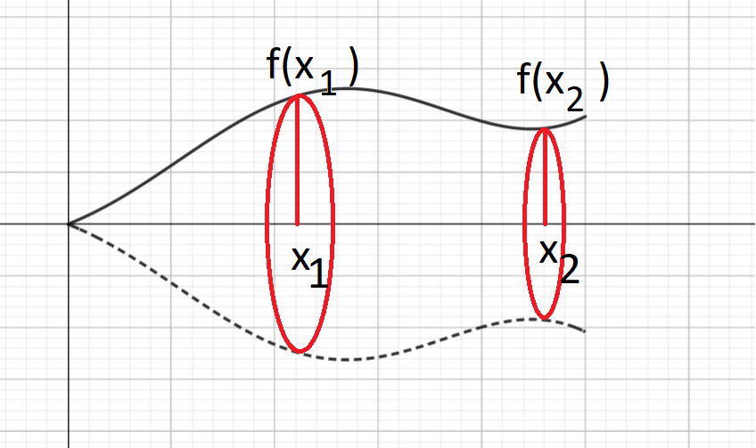
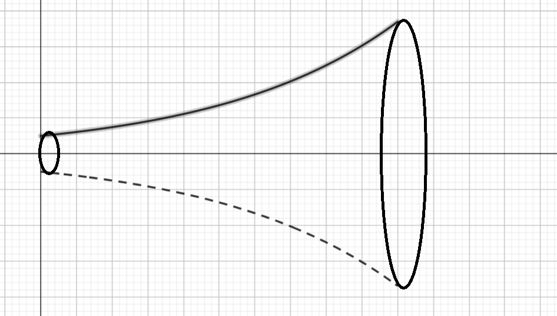

# Pyörähdyskappaleet

Tarkastellaan vielä erityistapauksena määrätyn integraalin sovelluksista pyörähdyskappaleen tilavuutta ja pinta-alaa. Pyörähdyskappale on jokin kolmiulotteinen muoto, joka on saatu aikaan siten, että jonkin funktion kuvaaja pyörähtää $x$-akselin ympäri. Funktion kuvaaja muodostaa siten kappaleen seinät.

## Tilavuus

Kun funktion kuvaaja pyörähtää $x$-akselin ympäri, niin joka kohtaan muodostuu ympyrä, jonka säde on funktion arvo $f(x)$. Oheisessa kuvassa on esitetty pyörähdyskappaleen poikkileikkaukset kohdissa $x_1$ ja $x_2$. Kohdassa $x_1$ poikkileikkausta vastaavan ympyrän säde on $f(x_1)$, kohdassa $x_2$ poikkileikkausta vastaavan ympyrän säde on $f(x_2)$. Yleisesti pisteessä $x_i$ ympyrän pinta-ala on $A_i=\pi f(x_i)^2$. 

Oletetaan, että kappaleen seinämät muodostava funktio alkaa pisteestä $x=a$ ja päättyy pisteeseen $x=b$. Kun lasketaan koko pyörähdyskappaleen tilavuutta $V$, niin kappale jaetaan äärettömän moneen, äärettömän ohueen viipaleeseen. Jokaisen viipaleen pinta-ala vastaa ympyrää, jonka säde on funktion arvo tietyssä pisteessä. Jokaisen ympyrän paksuudeksi ajatellaan hyvin pieni muutos vaaka-akselilla, $\text{d}x$. Äärettömän monta kappaletta äärettömän ohuita viipaleita saadaan laskemalla integraali:

$\int_a^b \pi f(x)^2~\text{d}x$

::::{admonition} Esimerkki

Kartion tilavuuden laskukaava on $V=\frac{1}{3} \pi r^2 h$, missä $r$ on kartion pohjaympyrän säde ja $h$ on kartion korkeus. Johda tilavuuden laskukaava integroimalla. Kuvassa on esitetty kartion seinämän muodostavan funktion kuvaaja. Kartio on kyljellään siten, että sen kärki on pisteessä (0,0).

:::{admonition} Ratkaisu
:class: tip, dropdown

Muodostetaan ensin funktion $f(x)$ lauseke. Kartion seinämän etäisyyttä kartion korkeusjanasta (kuvaajan $x$-akselista) kuvaa suora muotoa $y=ax+b$. Koska kärki on origossa, niin leikkausvakio on $b=0$. Kulmakertoimeksi saadaan

$a=\frac{r-0}{h-0}=\frac{r}{h}$.

Funktio on siis $f(x)=\frac{r}{h}x$, ja tilavuuden laskukaavassa tarvittava $f(x)^2=\frac{r^2}{h^2}x^2$.

Lasketaan määrätty integraali pisteestä $x=0$ pisteeseen $x=h$:

$\begin{align}
V & = \int_0^h \pi \frac{r^2}{h^2}x^2~\text{d} x = \pi \frac{r^2}{h^2} \int_0^h x^2~\text{d}x \\
& = \pi \frac{r^2}{h^2} \left(\frac{1}{3}h^3-\frac{1}{3} 0^3 \right) \\
& = \pi \frac{r^2}{h^2}  \cdot \frac{1}{3} h^3 = \frac{1}{3} \pi r^2 h
\end{align}$

:::

::::

::::{admonition} Esimerkki

Laske pyörähdyskappaleen tilavuus, kun sitä rajoittaa käyrä $f(x)=e^x$ välillä $0 \leq x \leq 2$.

:::{admonition} Ratkaisu
:class: tip, dropdown

$\begin{align}
V & = \int_0^2 \pi (e^x)^2~\text{d}x \\
& = \pi \int_0^2 e^{2x}~\text{d}x \\
& = \pi \cdot \left( \frac{1}{2}e^{2\cdot 2} - \frac{1}{2} e^{2\cdot 0} \right) \\
& = \frac{\pi}{2} (e^4-e^0) = \frac{\pi}{2} (e^4-1) \approx 84.2
\end{align}$

:::

::::

## Pinta-ala

Pyörähdyskappaleen pinta-ala lasketaan samalla periaatteella kuin tilavuus: jakamalla kappale äärettömän moneen, hyvien ohueeseen kiekkoon, joiden säteet ovat funktion arvoja. Pinta-alan ajatellaan siis muodostuvan äärettömän monesta hyvin kapeasta "vyöstä", jotka kiertävät pyörähdyskappaleen ympäri.

Kun pyörähdyskappaletta rajoittaa funktio $f(x)$ välillä $x_1 \leq x \leq x_2$, niin pyörähdyskappaleen pinta-ala on

$A=2\pi \int_{x_1}^{x_2} |f(x)|\sqrt{1+[f'(x)]^2}~\text{d}x$

:::{admonition} Perustelu
:class: tip, dropdown
täydentyy
:::

::::{admonition} Esimerkki

täydentyy

:::{admonition} Ratkaisu
:class: tip, dropdown

Täydentyy

:::

::::

